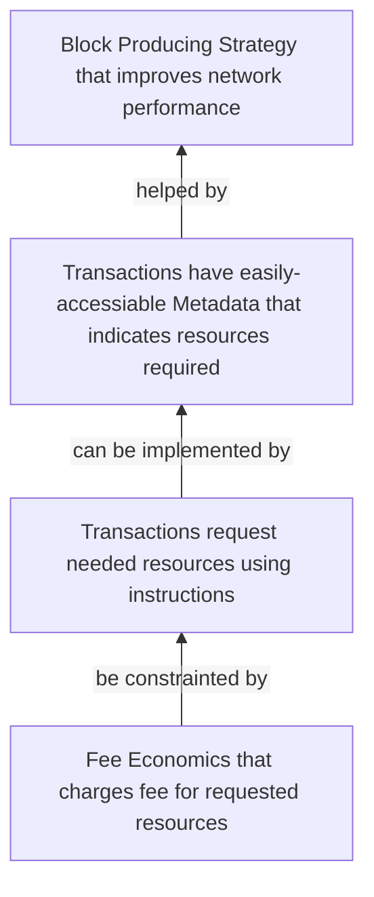

---
Enhancing Cluster Performance through Transaction Fee Economics Based on Efficient Resource Allocation
---

## Summary

To optimize cluster performance, achieve higher network throughput. We propose a solution to efficiently allocate cluster resources, resulting in performance improvements. By enabling transactions to declare their resource needs through transaction metadata, we can achieve the following benefits:

- **Transaction submitters** will have transparency regarding transaction costs.
- **Block producers** can make informed decisions on including transactions based on profitability.
- **Validators** can enhance parallelism by optimizing replay strategies according to resource allocation.

Furthermore, we propose a fee structure that charges transactions based on the resources requested. This approach encourages transaction submitters to request reasonable resource allocations and discourages overconsumption of system resources, ensuring fair compensation for operators.

## Motivation

Optimizing *Resource Allocation* is essential for achieving high network throughput and low latency. Currently, there is a lack of transparency in resource allocation for transactions, leading to suboptimal cluster performance. To address this issue, we need a solution that enables quick and cost-effective identification of a transaction's impact on cluster performance.

## Proposed Solution:

Our solution revolves around allowing transactions to declare their resource requirements using transaction metadata. This approach provides several benefits:

- Transaction Submitters: Submitters can accurately determine the cost of their transactions, allowing for better cost management.
- Block Producers: Block producers can make informed decisions about including transactions in blocks based on the profitability of resource allocation.
- Validators: Validators can enhance parallelism by optimizing replay strategies, taking into account the allocated resources.

### Resource Allocation and Fee Economics:

We propose a fee structure based on the resources requested by transactions. This approach aligns the interests of both transaction submitters and operators by charging fees according to the resources required. The fee structure encourages the following:

- Encouraging reasonable resource requests: Submitters are incentivized to request only the resources they genuinely need, avoiding the overallocation of resources.
- Discouraging overconsumption: Excessive resource requests result in higher fees, discouraging submitters from misallocating system resources.
- Fair compensation for operators: Operators are properly compensated for the resources they allocate to transactions.

How Fee Economics ensures proper Resource Allocation that helps performance improvement can be summarized by this chart:

## Terminology:

### Base Fee
A transaction's base fee, denominated in `lamport`, 
1. is used to compensate cost of cluster **Resources** allocated[^7] to the transaction;
2. is *deterministic* per transaction;
3. is calculated from **Resources** cost, which denominates in `compute unit`, by multiplying a static rate `X lamports/compute-unit`;
4. is partially burned and partially rewarded[^5][^6];
    
### Resources
Resources requested for a transaction, denominated in `compute units` (for now[^8]),
1. is the up limit of resources a transaction allowed consume, breaching any of resources limit will fail the transaction.[^9]
2. is multi-dimensional, include cost (based on baseline machine spec):
   1. CPU cycles for sigverify
   2. CPU cycles for VM execution
   3. CPU cycles for loading and storing accounts.[^11][^hotcold]
   4. memory for loaded accounts
   5. long term storage
   6. network bandwidth for both ingress and egress
3. is deterministic[^10]
4. is specified by (`compute budget`) instructions, available as Transaction Metadata;

[^5]: case against 100% reward is that it incentivize leaders to pick more expensive and heavier transactions to pack, which isn't the best for traffic optimization/load-balancing; 
[^6]: burn rate may need to be adjusted to align with inflation rate; the goal is to be sustainable: operators are being rewarded in both low/high demand; on-chain state owner (dApp dev) are being rewarded with demand for their state increased and failed tx rate drop; transactions submitter are encouraged sending less consuming txs
[^7]: Resources allocated to transaction is not necessary equal to Resources consumed by transaction. The contractor between transaction submitter, block producer and validators are: submitter request Resources for a transaction; producer determines (by profitability, usually) if going to include this transaction, if so, delicate requested resources to it (which becomes unavailable to other transactions); validators may use the information of requested resources to optimize replay. Reducing the gap between *resources requested* and *resources consumed* is a sign of improved efficiency.
[^8]: while folding everything into `Compute Unit` for simplification works for now, there might be benefit of measuring different resources in their own units.
[^9]: notice some of the limits are pre-runtime while others are within-runtime. Need to be consistent on charging transaction fees for both failed scenarios.
[^10]: other non-deterministic "resource cost", therefore is excluded from this proposal, is cost for *read/write lock* accounts. It often refers to two separate costs: the actual cost of acquiring a lock, which can be determined as cluster average, probably is near zero; and the cost of waiting to get lock, which is non-deterministic and should be covered by priority fee, or dynamic fee in the future.
[^11]: unless protocol defines what "cold account" is, for example, accounts have not been touched by 100 slots; cost of loading hot/cold accounts is non-deterministic, therefore should be excluded from this proposal.

## Implementation Plan:

To implement this solution effectively, we propose the following steps:

- Develop a system for transactions to declare their resource requirements through transaction metadata.
  - [ ] Add *Transaction Metadata* to runtime transaction type
  - [ ] Use actual operating costs as concrete data to define what **Resources** are
  - [ ] Add Compute Budget instructions to request additional resources
- Implement a fee calculation mechanism based on the declared resource needs of transactions.
  - [ ] Formulate `x lamports/cu`[^galactus][^rate][^floor][^gameplan]
  - [ ] Build (simulation) tool to formulate reward/burn rate (utilizing Banking Tracer data)
- Improve Prioritization Fee implementation for resources congestion control[^prio]
  - [ ] Prio-graph Scheduler to improve priority ordering
  - [ ] Build tool/dashboard to measure and monitor how prioritization fee is respected, and local fee market condition
  - [ ] Improve local fee market quality by increase prioritization fee unit[^fee-market]
- Educate the community about the benefits of this approach and the importance of reasonable resource requests.
  - [ ] build tool to evaluate if "base-fee + Priority-fee" is sufficient of solving spamming issue, improving performance, and balancing submitter/validator economic interests.[^dynamic]

## Expected Benefits:

By implementing our proposed solution, we anticipate the following benefits:

- Improved cluster performance, resulting in higher network throughput and lower latency.
- Greater transparency for transaction submitters, leading to better cost management.
- Informed decision-making for block producers and validators.
- A fair and efficient resource allocation system that aligns the interests of all stakeholders.

## Security Concerns:

- With transactions pay different fee, it is possible leaders would favorite certain transactions over others
  - burning portion of base fee?
  - make producer income from prioritization fee more significant from base fee?

- in the same line of thinking, could `simple vote transaction` be discriminated
  - `Simple vote transaction` to be scheduled and priced differently?
  - selected staked leaders to vote, as obligation? Selection is done similar way as leader schedule
  - consider to not allow Vote instruction embedded in normal transaction?

- Spammer sends prioritized txs with no payer balance to pay for it, therefore free to clog priority queue
  - Maybe check fee payer early (before entering prio queue) and _always_ charge prio fee (since it's work done in leader)?

- Transactions request large resources that would failed without paying anything (as happens currently) could dos leader
  - make failed transactions pay too?

- w.r.t. Dynamic base fee: leader wants transactions pay highest fee, with dynamic base fee, leaders could artificially bump block utilization (by sending own txs), or modify code to pick high rate, to increase transaction dynamic fee?
  - 100% burn dynamic fee?

- Maybe necessary to audit the proposed economic mode for potential attack vectors. Perhaps just publish a white paper, get peer review etc.

## Conclusion:

Efficient resource allocation is a fundamental aspect of optimizing cluster performance in Solana networks. Our proposal aims to introduce a fee structure and resource declaration mechanism that will significantly improve the overall cluster performance, benefiting all participants in the network.

[^prio]: Prioritization fee is intended to create a localized fee market for contended accounts (or block space); it is currently not working properly due to two main issues:
    1. priority fee does not _always_ improve early block inclusion for higher paid TX due to lack of central scheduling in banking_stage
       - need to clarify the Priority promise: is it best-effort of landing received TX ahead of others
       - timing sending prioritized transactions to next leader(s) improved priority
    2. local fee market quality is too lower due to too small tick size (leave a lot of rooms for exploitation)
       - to improve Local fee market (priority fee) adaptation

[^galactus]: Galactus summarizes the formular for rate at https://www.notion.so/Base-fees-in-Solana-83af1d7eafc848fdb726a64748281f87

[^rate]: Toly suggested another possibility of setting base fee rate to median of staked validators' signal (per epoch). This also helps to compensate validators nicely.

[^floor]: Base fee floor could probably be computed as a median validator signal, or use governance;

[^dynamic]: Is "dynamic base fee" still necessary if "base-fee + prio-fee" works? Maybe not. Dynamic Base Fee is per-write-lock, and is to modulate the demand and ideally establish a price at which one should "normally" pay to be able to get access. Prio fee is more eth gas fee which is "global" in a sense, it is used when dynamic base fee effect being slow.

[^hotcold]: Cost of loading hot/cold accounts.
    - the performance difference of loading hot/cold accounts is solely based on **local** cache implementation, which is not deterministic, therefore cannot naively be part of deterministic base-fee;
    - unless "cold account" is defined by protocol:
      1. Protocol defines what *cold account* is, say not used in 100 slots; validators is expected to comply with this, much like comply with Hardware Requirement.
      1. Submitter use RPC or simulator to query cluster to find how many his transaction's accounts are *Cold*.
      1. Submitter include "number of cold accounts" in its **Resource Request**, where it's cost is predetermined, wherefore fee's deterministic too;
      1. Should Producer not comply with protocol's *Cold* definition, that is, account is less than 100 slots old are off cache, then in current sync-execution mode, it eats into leader's 400ms slot time, therefore reduce TPS; in future async-execution, there will be no impact;
      1. Should validators not comply with *Cold* definition, it'd delay replay; if more than 1/3 violate it, cluster may become vote-only, or even fork.
    - Or if possible for Protocol to define loading cold account is *x* times more expensive then loading hot accounts. This is an average just like anything else in compute_budget.
      1. `runtime` consumes transaction's compute-budget accordingly based on if account is hot or cold.
      1. Transaction would fail as soon as its compute-unit-limit is exceeded
      1. Block producer is motivated to check if transaction contains cold accounts, analyze if its compute-unit-limit is sufficient, before packing it. Because a including would-fail-tx is not to producer's self-interest;
      1. Transaction submitter is motivated to check account hot/cold status (via RPC) as part of simulation, otherwise they have to request additional compute-unit-limit, therefore paying higher fees. 
      1. This require payer also needs to pay failed transactions
      1. The worse case scenario: submitter does not check account coldness, leader doesn't care about fee-collecting success rate, then we could have a severely under-priced block. But runtime will detect cold account and fail transaction as soon as requested cu limit is exceeded.
    - another option is to create a market for accounts loading
      1. Submitter can request up to *xyz* Compute Units to load accounts for this transaction. Producer could have better idea of requested accounts hot/cold status to help decide if including such transaction is profitable. 
      1. Protocol defines **cold**, and cost of loading cold accounts. Requested CUs for loading accounts go to block limit;
      1. What is loading cold account is more expensive than 48M CU (eg 400ms)?

[^fee-market]: with tiny prio fee units, we see priority fee range from [5, 300_000+], which reduce the local fee market quality, cause the min/max fee doesn't mean much then just random. Ideally user should be able to query what's minimum fee to get chance of access the account, and what was the latest maximum fee. Pyth could have used that info to set their write-lock priority transparently, if the local fee market has high quality.

[^gameplan]: a potential end goal could be:
    1. create a off-chain program that implements an community agreed formula to calculate lamport/CU from current epoch.
    1. everyone can run it,
    1. staked validators can then optionally submit vote for next epoch lamport/cu, may or may-not use the value returned from the offchain tool
    1. a on-chain program aggregates such vote, if reach consensus, the next epoch lamport/cu will be updated.
    So the off-chain tool is just informational, validator can submit whatever lamport/cu they wished, so long they can get majority.

